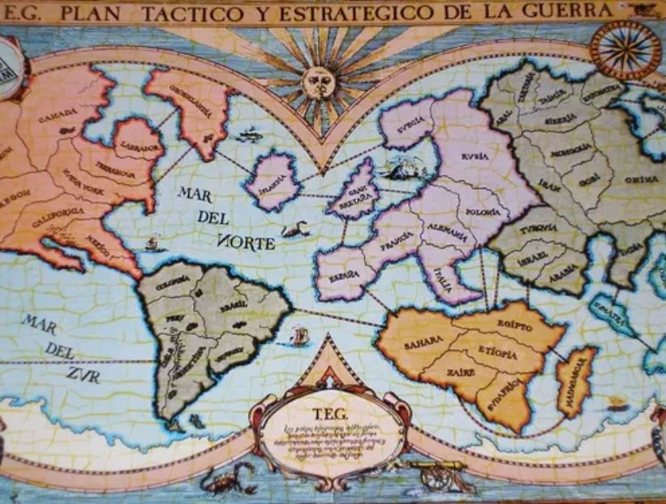

  

# TEG

El TEG (Táctica y Estrategia de la Guerra) es un clásico juego de mesa de estrategia que desafía a los jugadores a 
conquistar el mundo mediante la planificación, la negociación y la toma de decisiones tácticas. Inspirado en juegos 
de guerra y geopolítica, el TEG combina azar y estrategia, obligando a los jugadores a gestionar recursos, evaluar 
riesgos y anticipar movimientos enemigos para lograr sus objetivos de dominación global. El juego propone un 
conflicto bélico que tiene lugar sobre un mapa-tablero dividido en 50 países.

En este contexto, como parte de la materia Programación III, se presenta el desafío de desarrollar una versión 
digital del TEG, implementando tanto el front-end como el back-end del juego. Este proyecto no solo pondrá a 
prueba los conocimientos adquiridos en programación, sino que también requerirá una comprensión profunda de las 
reglas y mecánicas del juego, además de habilidades en diseño de interfaces, manejo de datos y lógica de negocio.

Los estudiantes deberán aplicar conceptos clave de desarrollo de software, tales como arquitectura cliente-servidor, 
comunicación a través de APIs, gestión del estado del juego y sincronización de eventos en una aplicación 
interactiva y funcional.

Este desafío ofrece una oportunidad única para integrar conocimientos teóricos con su aplicación práctica en un 
proyecto realista, fomentando la creatividad y el trabajo en equipo.

## Reglamento TEG a usar

[REGLAMENTO](./docs/assets/TEG.pdf)

# TPI

Este proyecto es parte del Trabajo Práctico Integrador (TPI) realizado durante el año 2025,
de la asignatura Programación III de la carrera "Tecnicatura Universitaria en Programación"
de la "Universidad Tecnológica Nacional - Facultad Regional Córdoba".